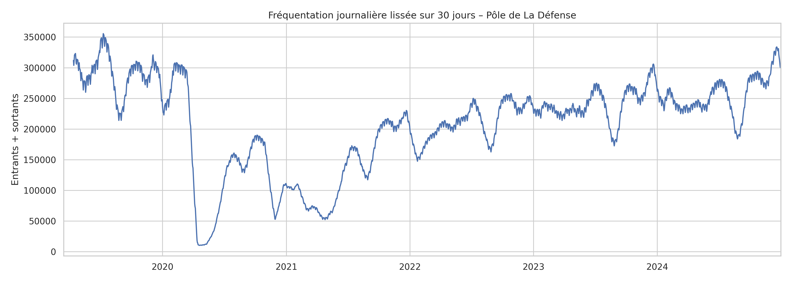
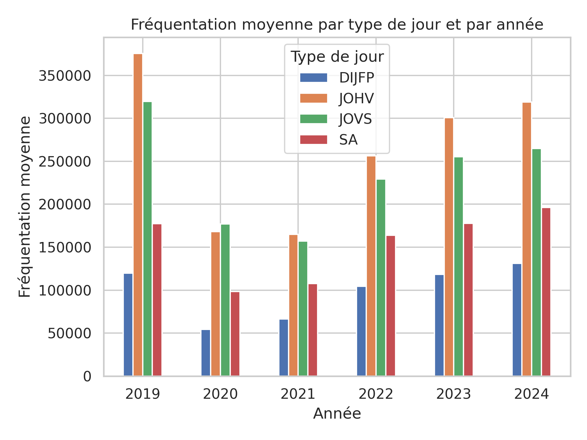
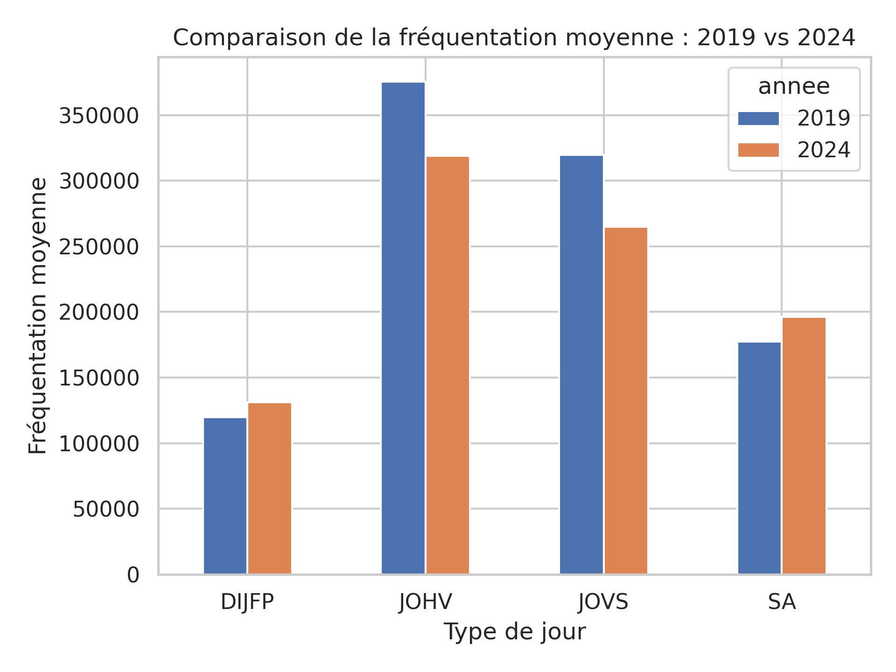

# Analyse de la fréquentation du Pôle de La Défense – RATP (2019–2024)

## Contexte

Expérimentation de comptage en continu menée par la RATP entre mars 2019 et décembre 2024.  
14 postes couvrant l'intégralité des accès aux stations **Grande Arche** et **Esplanade de La Défense**.  
Source : [Open Data RATP – data.gouv.fr](https://www.data.gouv.fr/fr/datasets/frequentation-du-pole-de-la-defense-experimentation-lissage-des-heures-de-pointe/) — Licence Ouverte Etalab.

## Objectifs

- Mesurer l'impact de la crise COVID-19 sur la fréquentation
- Évaluer la reprise 2022–2024 par type de jour (JOHV, JOVS, SA, DIJFP)
- Analyser l'efficacité de l'expérimentation de lissage des heures de pointe

## Conclusions clés

| Indicateur | 2019 | 2024 | Variation |
|---|---|---|---|
| Fréq. moy. JOHV | 375 000 | 319 000 | **−15%** |
| Fréq. moy. SA | 177 000 | 196 000 | **+11%** |
| Fréq. moy. DIJFP | 120 000 | 131 000 | **+9%** |
| Pointe matin 8h+9h | 22,2% | 21,8% | −0,4 pt |
| Pointe soir 17h+18h | 23,9% | 23,9% | stable |

- Les **jours ouvrés** n'ont récupéré que 85% de leur niveau 2019 → effet télétravail durable
- Les **week-ends** dépassent 2019 → essor des usages loisirs post-COVID
- La **pointe du matin** montre un léger lissage ; la **pointe du soir** est inchangée

## Visualisations

## Stack technique

Python · Pandas · Matplotlib · Seaborn · OpenPyXL
